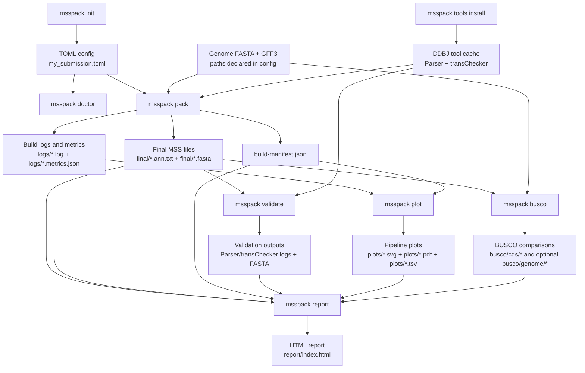

# msspack


`msspack` builds DDBJ MSS submission files from genome FASTA + GFF inputs and runs the official DDBJ checking tools.

For the official submission workflow, file requirements, and checking tools, see the DDBJ [MSS - Mass Submission System](https://www.ddbj.nig.ac.jp/ddbj/mss.html) documentation.

The MSS conversion layer in this repository was originally developed by adapting logic from the MIT-licensed [`GFF2MSS`](https://github.com/maedat/GFF2MSS) project. That logic now lives as internal `msspack` modules under `src/msspack/mss_converter/`, while the surrounding preprocessing, packaging, caching, and DDBJ tool orchestration are implemented directly in `msspack`.

## Current scope

- Render `COMMON` header sections from a TOML config
- Run the existing preprocessing chain used in the current submissions
- Run a bundled MSS converter
- Use bundled GFF/CDS extraction, padding, and gap-normalization helpers
- Convert selected CDS features to `misc_feature`
- Download and run DDBJ `Parser` and `transChecker`
- Check local runtime dependencies with `msspack doctor`
- Reuse unchanged intermediate files so iterative reruns stay fast
- Run `Parser` and `transChecker` in parallel when both need validation
- Write a `build-manifest.json` summary for each run
- Run BUSCO on GFF-derived CDS sets by default, with optional genome FASTA comparison
- Render stage-wise pipeline Sankey, event-count, and changed-gene overlap plots from packaging logs
- Render a single HTML report that links final outputs, validation, BUSCO, plots, and structured stage metrics

## Installation

```bash
python3 -m venv .venv
source .venv/bin/activate
pip install -e .
```

You will still need `java` available on `PATH` to run DDBJ validation.
If you want BUSCO comparison plots, install `busco` separately and make sure it is available on `PATH` or set `busco.command` in the config.

For development, install the extra tooling:

```bash
pip install -e .[dev]
```

## Quick start

Create a starter config:

```bash
msspack init my_submission.toml
```

The species-specific configs in [`examples/`](examples/) are sanitized templates for schema and workflow reference. Before running them, replace the placeholder input paths and submitter details with your local values.

Inspect your environment:

```bash
msspack doctor --config my_submission.toml
```

Install the latest DDBJ validation tools into the cache:

```bash
msspack tools install
```

Install `UME` only if you need it explicitly:

```bash
msspack tools install ume
```

Run the packaging pipeline:

```bash
msspack pack --config my_submission.toml
```

Run BUSCO on the GFF-derived CDS input/output FASTA files and generate comparison plots:

```bash
msspack busco --config my_submission.toml
```

Add genome comparison explicitly when you want it:

```bash
msspack busco --config my_submission.toml --genome
```

Clear any stale temporary BUSCO staging workspaces before a rerun:

```bash
msspack busco --config my_submission.toml --clean-cache
```

Render stage-wise Sankey, event-count, and changed-gene overlap plots from an existing `pack` build:

```bash
msspack plot --config my_submission.toml
```

Render an HTML report from the current build:

```bash
msspack report --config my_submission.toml
```

By default, `msspack busco` runs only the CDS comparison. When `busco.lineage_dataset` is empty and `busco.auto_lineage = true`, `msspack` auto-selects a lineage from the first enabled input set, then reuses that same lineage dataset for the matching processed run and any additional enabled comparison so the results stay on the same benchmark.
If your project path contains spaces, `msspack` stages BUSCO execution in a no-space cache workspace automatically, then copies the raw BUSCO output tree back into the project build directory.
If a previous BUSCO run was interrupted, `--clean-cache` removes the temporary no-space staging area under the `msspack` cache before starting again.

If inputs, config, and relevant code have not changed, `msspack` reuses existing intermediate files and validation outputs on rerun instead of rebuilding everything.

Set `pipeline.validate_in_parallel = false` if you want sequential validation to reduce peak memory usage.

Each `pack` run also writes `build-manifest.json` under the build root so you can inspect the input paths, config hash, stage-level cache reuse, final outputs, and validation settings afterward.
`msspack plot` writes `plots/pipeline-flow-summary.{json,tsv}`, `plots/pipeline-gene-flow.sankey.{svg,pdf}`, `plots/pipeline-event-counts.{svg,pdf}`, and `plots/pipeline-gene-overlap.{tsv,svg,pdf}` under the same build root, and also records those paths in `build-manifest.json`.
Most numbered pipeline stages also emit `logs/*.metrics.json` sidecars so downstream reporting can read stable structured counts without parsing human-readable log prose.
`msspack report` writes `report/index.html` under the build root and links the final submission files, validation outputs, BUSCO comparisons, plots, and structured stage metrics in one place.

For step-level debugging, `msspack` now exposes a single internal namespace such as `msspack internal select-one-mrna ...` and `msspack internal gff3sort ...`. The old `src/msspack/steps/*.py` standalone helper entrypoints have been removed so there is only one maintained CLI surface.
Intermediate files and logs now use sequential descriptive stage names such as `04.gff.semicolons-fixed.gff` and `11.update-gff-with-padding.log` so the build directory is easier to inspect.

## Command workflow

GitHub renders the following Mermaid diagram directly in this README. It shows how the main `msspack` commands pass files to each other:



| Command | Main inputs | Main outputs |
| --- | --- | --- |
| `msspack init my_submission.toml` | Bundled template | A starter TOML config |
| `msspack doctor --config my_submission.toml` | Config and local environment | Text dependency report on stdout |
| `msspack tools install` | DDBJ download page and local cache path | Cached `Parser` and `transChecker` installations |
| `msspack pack --config my_submission.toml` | Config, genome FASTA, GFF3, cached validation tools | `final/*.ann.txt`, `final/*.fasta`, `logs/*`, `logs/*.metrics.json`, `build-manifest.json` |
| `msspack validate --config my_submission.toml --ann final/*.ann.txt --fasta final/*.fasta` | Existing MSS annotation and FASTA files, cached validation tools | Parser/transChecker logs and transChecker FASTA outputs |
| `msspack plot --config my_submission.toml` | Existing `pack` build logs, metrics, and manifest | Pipeline Sankey, event-count, and changed-gene overlap plots under `plots/` |
| `msspack busco --config my_submission.toml` | Existing `pack` outputs and GFF-derived CDS FASTA sets | BUSCO summaries and comparison plots under `busco/cds/` |
| `msspack busco --config my_submission.toml --genome` | CDS inputs plus genome FASTA before and after processing | Additional BUSCO summaries and comparison plots under `busco/genome/` |
| `msspack report --config my_submission.toml` | Final MSS files, logs, metrics, manifest, validation outputs, plots, and BUSCO outputs | `report/index.html` |

## Example outputs

`msspack plot` renders a stage-wise Sankey diagram that summarizes how gene models move through the packaging pipeline. This example was generated from synthetic stage metrics so no unpublished submission data are exposed.


`msspack busco` can also render a compact BUSCO comparison for GFF-derived CDS FASTA sets. The example below uses synthetic BUSCO summary values so no unpublished assembly metrics are exposed.


## Config

See [`examples/msspack.example.toml`](examples/msspack.example.toml) for the current schema.
Older configs may still contain `tools.gff3sort`; that legacy setting is now ignored because `msspack` sorts GFF internally.
Example configs now avoid real local paths and personal contact details so the repository can be published safely.
`msspack init` writes the same bundled template that is mirrored in [`examples/msspack.example.toml`](examples/msspack.example.toml).
The optional `[busco]` section controls the `msspack busco` command. By default it writes only `cds/` under `build/<project>/busco/`; set `busco.run_genome = true` or pass `--genome` to also write `genome/`. Each enabled subdirectory contains raw BUSCO runs, normalized JSON summaries, `comparison.tsv`, `comparison.svg`, and `comparison.pdf`. The CDS comparison uses spliced CDS FASTA files extracted from the input GFF and the final processed GFF, and `busco.cds_mode` defaults to `transcriptome`.

The bundled converter is adapted from `GFF2MSS` under the MIT license. See [`THIRD_PARTY_NOTICES.md`](THIRD_PARTY_NOTICES.md).

## Attribution

The MSS conversion layer in `msspack` derives from ideas and code paths originally adapted from [`GFF2MSS`](https://github.com/maedat/GFF2MSS) by Taro Maeda. The current converter is implemented as native `msspack` modules in `src/msspack/mss_converter/`, not as a bundled external dependency, but we retain attribution and MIT-license notice for the adapted portions in [`THIRD_PARTY_NOTICES.md`](THIRD_PARTY_NOTICES.md).

## Licensing

The `msspack` repository is distributed under the MIT License. See [`LICENSE`](LICENSE).

Some portions of the MSS converter were originally adapted from [`GFF2MSS`](https://github.com/maedat/GFF2MSS). That attribution and preserved third-party notice are documented in [`THIRD_PARTY_NOTICES.md`](THIRD_PARTY_NOTICES.md).

## Development

The repository includes `ruff`, `mypy`, `unittest`, and wheel-build checks in CI. Local contributor workflow is documented in [`CONTRIBUTING.md`](CONTRIBUTING.md), and release steps are summarized in [`RELEASE.md`](RELEASE.md).

To clean repo-local build, cache, and BUSCO artifact files before a fresh run:

```bash
python scripts/clean_artifacts.py
```

## Benchmarking

Use the benchmark harness in [`scripts/benchmark_pack.py`](scripts/benchmark_pack.py) to compare fresh and cached runs:

```bash
python scripts/benchmark_pack.py --config /path/to/config.toml --repeats 3 --no-validate
python scripts/benchmark_pack.py --config /path/to/config.toml --repeats 3 --clean-first --clean-between-runs
```

The first command measures reruns against an existing build. The second forces a fresh rebuild on every run.

## Project background

`msspack` started by vendoring the `GFF2MSS` conversion core into this repository so that MSS generation would no longer depend on a separately installed `gff2mss` package. Over time that vendored code was refactored into native `msspack` modules in `src/msspack/mss_converter/`, while the surrounding preprocessing, packaging, caching, and DDBJ tool orchestration were implemented directly in `msspack`.

In other words, the project no longer shells out to an external `gff2mss` install, and it also no longer requires external `gffread` or `gff3sort.pl` commands for the current packaging pipeline. `msspack` is now its own application and pipeline, but its MSS converter still includes logic derived from `GFF2MSS`. License and attribution details for derived or adapted code are documented in [`THIRD_PARTY_NOTICES.md`](THIRD_PARTY_NOTICES.md).

## Roadmap

- Add regression fixtures based on previous MSS submissions
- Continue shrinking large internal modules where the stage graph is still dense
- Add more real-submission regression fixtures alongside the minimal packaged fixture
