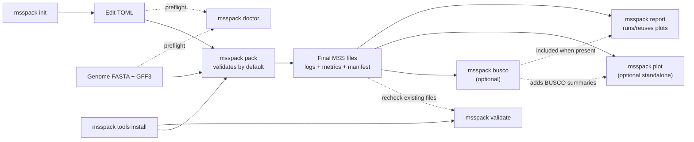

# msspack


`msspack` converts a genome FASTA and GFF3 annotation into validated DDBJ MSS
`.ann.txt` and `.fasta` files. A single TOML config controls gene-model cleanup,
submission metadata, optional functional annotation, BUSCO comparisons, plots, and
an HTML run report.

For submission requirements, see the DDBJ
[MSS - Mass Submission System](https://www.ddbj.nig.ac.jp/ddbj/mss-e.html)
documentation.

## Features

- Clean gene models and render MSS annotation and FASTA files with `COMMON` records
- Run the official DDBJ `Parser` and `transChecker`
- Reuse unchanged intermediates while recording logs, metrics, and a build manifest
- Optionally assign conservative protein products from Swiss-Prot, UniRef90, Pfam,
  and CDD
- Compare BUSCO results before and after CDS-boundary adjustment
- Generate a stage-wise pipeline Sankey, supporting figures, and a linked HTML report

## Installation

Install `msspack` directly from GitHub:

```bash
pip install git+https://github.com/kfuku52/msspack.git
```

Python 3.11 or newer is required; an isolated environment is recommended. CI tests
Python 3.11 through 3.14.

With conda or mamba, install the external runtime tools in the same environment:

```bash
conda create -n msspack -c conda-forge -c bioconda "python>=3.11" pip openjdk busco diamond hmmer
conda activate msspack
pip install git+https://github.com/kfuku52/msspack.git
```

`openjdk` provides the `java` command used by the DDBJ validation tools. BUSCO,
DIAMOND, and HMMER are optional. CDD annotation additionally requires `rpsblast` and
`rpsbproc`; `msspack doctor` reports which tools are needed for the enabled features.

The core pipeline is platform-independent, but automated installation and execution
of the DDBJ `Parser` and `transChecker` currently support Linux and macOS. On Windows,
use WSL or run the DDBJ Windows tools separately.

## Quick Start

Create and edit a starter config:

```bash
msspack init my_submission.toml
```

`msspack init` refuses to replace an existing file. Pass `--force` only when you
intentionally want to overwrite it.

Install the DDBJ validation-tool versions reviewed for this `msspack` release:

```bash
msspack tools install
```

The DDBJ tools are downloaded from DDBJ and are not distributed under the `msspack`
MIT license. Review the
[DDBJ validation-tool agreement](https://www.ddbj.nig.ac.jp/ddbj/mss-tool-e.html)
before installing or using them. `msspack pack` does not download these tools
implicitly; when validation is enabled, install them explicitly first.

Check the completed config and runtime environment, then run the pipeline:

```bash
msspack doctor --config my_submission.toml
msspack pack --config my_submission.toml
```

BUSCO and the HTML report are optional:

```bash
msspack busco --config my_submission.toml
msspack report --config my_submission.toml
```

`report` creates or reuses the pipeline plots. Run
`msspack plot --config my_submission.toml` only when the standalone Sankey and
supporting figures are needed without an HTML report.

The species-specific configs in [`examples/`](examples/) are sanitized schema
examples. Replace every placeholder path and submitter field before use.

## Command Workflow



`pack` runs Parser and transChecker unless `--no-validate` is specified. `busco`
creates or reuses the required `pack` intermediates.

| Command | Purpose |
| --- | --- |
| `msspack init my_submission.toml` | Write a starter TOML config |
| `msspack doctor --config my_submission.toml` | Check the config, inputs, and required tools |
| `msspack tools install` | Download the reviewed DDBJ validation tools |
| `msspack pack --config my_submission.toml` | Build and validate the MSS files |
| `msspack validate --ann FILE --fasta FILE` | Recheck existing MSS files |
| `msspack busco --config my_submission.toml` | Compare BUSCO results for input and processed sequences |
| `msspack plot --config my_submission.toml` | Render the pipeline Sankey and supporting figures |
| `msspack report --config my_submission.toml` | Render/reuse plots and write the HTML report |

## Example Outputs

The main output of `msspack plot` is a stage-wise Sankey diagram that follows gene
models from the input GFF through filtering, boundary adjustment, functional
annotation, and final MSS output. A horizontal event-count chart provides the
supporting counts and distinguishes genes from transcripts. When annotation
consistency is enabled, additional figures summarize threshold sensitivity and
evidence-source agreement.

If CDS BUSCO results are available, the Sankey adds pies for the input and
boundary-adjusted CDS sets. A name-consistency pie appears in the same summary row when
that audit is enabled. Zero-count branches are omitted from the Sankey but remain
available in the event-count plot and TSV files.

Functional annotation adds a stage ordered by assignment priority: Swiss-Prot, an
optional close-reference database, UniRef90, Pfam, CDD, preserved products, and
unannotated rows.

The figure below is from a complete example run with Swiss-Prot, taxon-scoped
UniRef90, Pfam, CDD, BUSCO, and the close-family name-consistency audit enabled.


### Product-name examples

These representative products are taken from the same example run. The table shows
the standardized names written to `ann.txt` and their supporting database records.

| Source | Final product name | Evidence |
| --- | --- | --- |
| Swiss-Prot | `glyceraldehyde-3-phosphate dehydrogenase B` | `P12860` |
| Swiss-Prot | `DNA-directed RNA polymerase V subunit 7` | `A6QRA1` |
| Swiss-Prot | `mechanosensitive ion channel protein 6` | `Q9SYM1` |
| UniRef90 | `DNA 5'-3' helicase FANCJ` | `UniRef90_A0A9R0IUZ0` |
| UniRef90 | `signal peptidase complex catalytic subunit SEC11` | `UniRef90_A0AAD3S319` |
| UniRef90 | `tRNA (adenine(58)-N(1))-methyltransferase non-catalytic subunit TRM6` | `UniRef90_A0AAD3SMY0` |
| Pfam | `HMG (high mobility group) box domain-containing protein` | `PF00505` |
| Pfam | `bZIP transcription factor domain-containing protein` | `PF00170` |
| Pfam | `casparian strip membrane protein domain-containing protein` | `PF04535` |
| CDD | `UDP-glycosyltransferase family protein` | `cd03784` |
| CDD | `plant-specific B3-DNA binding domain-containing protein` | `cd10017` |
| CDD | `cytochrome P450 (CYP) superfamily protein` | `cl41757` |

## Configuration

Run `msspack init my_submission.toml`, then edit the generated file. It contains the
required project, input, sample, submission, submitter, reference, and assembly metadata;
the complete schema and defaults are in
[`examples/msspack.example.toml`](examples/msspack.example.toml).

Common optional settings are:

```toml
[functional_annotation]
enabled = true
pfam_enabled = true
cdd_enabled = true

[functional_annotation.consistency]
enabled = true

[busco]
run_cds = true
run_genome = false
auto_lineage = true
threads = 8
```

- Functional annotation searches Swiss-Prot and optional taxon-scoped UniRef90, then
  uses Pfam and CDD as domain fallbacks. Set `uniref90_enabled = true` with an
  appropriate `uniref90_taxon_id`; downloading full UniRef90 is usually unnecessary.
- Databases are downloaded once to the msspack cache and reused. Local database paths
  can be supplied for offline runs.
- Taxonomy is inferred from `sample.scientific_name` and cross-checked against BUSCO,
  without assuming that the input is a plant.
- Product names are standardized to DDBJ/NCBI/EMBL-EBI conventions before the family
  audit. Uninformative evidence remains `hypothetical protein`. Default
  identity/mutual-coverage thresholds are 90/90%, 70/80%, and 40/60% for
  near-identical, close-family, and broad homologs.
- BUSCO compares CDS derived from the input and boundary-adjusted GFF by default.
  Enable `run_genome` only when a genome-level comparison is also needed.

Run `msspack doctor --config my_submission.toml` after enabling optional databases or
BUSCO. Detailed evidence, naming decisions, consistency tables, timings, and plots are
written under `final/`, `logs/`, `busco/`, and `plots/` in the configured output
directory.

## Development

See [`CONTRIBUTING.md`](CONTRIBUTING.md) for the contributor workflow and
[`RELEASE.md`](RELEASE.md) for release steps.

For local development:

```bash
git clone https://github.com/kfuku52/msspack.git
cd msspack
python3.11 -m venv .venv
source .venv/bin/activate
pip install -e ".[dev]"
```

If the repository already has an environment created for an older Python or `msspack`
release, remove and recreate that environment before installing the current development
dependencies.

Run checks locally with:

```bash
PYTHONPATH=src python -m unittest discover -s tests -v
ruff check .
mypy src
pip-audit .
```

To clean repo-local build, cache, and BUSCO artifact files before a fresh run:

```bash
python scripts/clean_artifacts.py
```

Use [`scripts/benchmark_pack.py`](scripts/benchmark_pack.py) to compare fresh and
cached runs:

```bash
python scripts/benchmark_pack.py --config /path/to/config.toml --repeats 3 --no-validate
python scripts/benchmark_pack.py --config /path/to/config.toml --repeats 3 --clean-first --clean-between-runs
```

## Attribution

The MSS conversion layer builds on ideas and code paths adapted from Taro Maeda's
MIT-licensed [`GFF2MSS`](https://github.com/maedat/GFF2MSS) project. The current
converter is implemented in `src/msspack/mss_converter/`.

See [`THIRD_PARTY_NOTICES.md`](THIRD_PARTY_NOTICES.md) for license and attribution
details.

## License

`msspack` is distributed under the MIT License. See [`LICENSE`](LICENSE).
