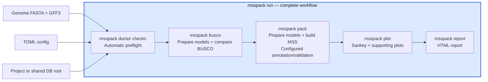

# msspack


`msspack` converts a genome FASTA and GFF3 annotation into DDBJ MSS `.ann.txt` and
`.fasta` files and can validate them with the official DDBJ tools. A single TOML
config controls gene-model cleanup, submission metadata, optional functional
annotation, BUSCO comparisons, plots, and an HTML run report.

For submission requirements, see the DDBJ
[MSS - Mass Submission System](https://www.ddbj.nig.ac.jp/ddbj/mss-e.html)
documentation.

## Features

- Clean gene models and render MSS annotation and FASTA files with `COMMON` records
- Preserve mixed GFF3 annotations, including coding transcripts, non-coding RNAs,
  pseudogenes, repeats, regulatory regions, and other INSDC feature types
- Run the official DDBJ `Parser` and `transChecker`
- Reuse unchanged intermediates while recording logs, metrics, and a build manifest
- Optionally assign conservative protein products from Swiss-Prot, UniRef90, Pfam,
  and CDD
- Compare BUSCO results before and after CDS-boundary adjustment
- Generate a stage-wise pipeline Sankey, supporting figures, and a linked HTML report
- Ship a compact, deliberately non-submittable demonstration dataset

## Installation

Install `msspack` directly from GitHub:

```bash
pip install git+https://github.com/kfuku52/msspack.git
```

Python 3.11 or newer is required; an isolated environment is recommended. CI tests
Python 3.11 through 3.14.

With conda or mamba, install the external runtime tools in the same environment:

```bash
conda create -n msspack -c conda-forge -c bioconda "python>=3.11" pip openjdk busco diamond hmmer
conda activate msspack
pip install git+https://github.com/kfuku52/msspack.git
```

`openjdk` provides the `java` command used by the DDBJ validation tools. BUSCO,
DIAMOND, and HMMER are optional. CDD annotation additionally requires `rpsblast` and
`rpsbproc`; `msspack doctor` reports which tools are needed for the enabled features.

The core pipeline is platform-independent, but automated installation and execution
of the DDBJ `Parser` and `transChecker` currently support Linux and macOS. On Windows,
use WSL or run the DDBJ Windows tools separately.

## Quick Start

Create and edit a starter config:

```bash
msspack init my_submission.toml
```

`msspack init` refuses to replace an existing file. Pass `--force` only when you
intentionally want to overwrite it.

To try the complete core workflow without preparing input data:

```bash
msspack demo --output msspack-demo
cd msspack-demo
msspack run --config config.toml --no-busco --no-validate
```

The bundled demo uses a fictional organism, fictional sequence and locus IDs, and
deliberately invalid BioProject, BioSample, and SRA accessions. It is suitable for
testing, but its MSS output must not be submitted. The optional
`config.functional.toml` uses the included local protein reference and DIAMOND
without downloading external annotation databases.

Install the DDBJ validation-tool versions reviewed for this `msspack` release:

```bash
msspack tools install
```

The DDBJ tools are downloaded from DDBJ and are not distributed under the `msspack`
MIT license. Review the
[DDBJ validation-tool agreement](https://www.ddbj.nig.ac.jp/ddbj/mss-tool-e.html)
before installing or using them. `msspack pack` does not download these tools
implicitly; when validation is enabled, install them explicitly first.

Check the completed config and runtime environment, then run the complete workflow:

```bash
msspack doctor --config my_submission.toml
msspack run --config my_submission.toml
```

`run` prepares the input models, runs the configured BUSCO comparisons and functional
annotation, builds the MSS files, runs enabled validation, renders the Sankey and
supporting figures, and writes the HTML report. Individual stages can still be run
separately.

For a lighter run:

```bash
msspack run --config my_submission.toml --no-busco --no-validate --no-report
```

`--force-compute` rebuilds analysis outputs but retains downloaded databases.
`report` creates or reuses the pipeline plots. Run
`msspack plot --config my_submission.toml` only when the standalone Sankey and
supporting figures are needed without an HTML report.

Coordinate duplicate removal also produces a genome-browser-style comparison of
kept and removed gene models. By default the figure shows the first 50 removed
genes, while its TSV retains all rows. Set `plots.coordinate_duplicate_limit` in
the config to change the figure limit.

Exact-coordinate gene collisions use `pipeline.coordinate_duplicate_policy =
"longest_valid_cds"` by default. Candidates are ranked by valid translated CDS,
fewer internal stops, start/stop completeness, fewer ambiguous amino acids,
longer total CDS, and finally fewer introns. This uses only the input GFF3,
reference FASTA, and configured genetic code. Set the policy to `"first"` for the
legacy input-order behavior or `"keep_all"` to disable automatic removal.

The species-specific configs in [`examples/`](examples/) are sanitized schema
examples. Replace every placeholder path and submitter field before use.

### GFF3 feature handling

CDS boundary adjustment is restricted to the targeted coding transcript. Its exon,
start/stop codon, UTR, and intron rows are synchronized afterward; other transcripts
and non-coding genes are not adjusted. Every adjusted model is checked for parent-child
containment, three-base terminal codons, and UTR/CDS overlap before the next stage.

The MSS converter emits CDS by default. For a coding transcript, it emits mRNA and
its exon/intron/UTR structure only when the mature transcript adds information beyond
the CDS—for example UTR sequence, non-coding exons, or alternative isoforms. A model
whose exon coverage is identical to its CDS is rendered as CDS alone. Transcripts
without a CDS remain explicit mRNA features.

rRNA, tRNA, tmRNA, ncRNA, repeat, regulatory, mobile-element, peptide, and other
recognized GFF3 annotations are retained and mapped to DDBJ-supported INSDC feature
keys. Pseudogenes are encoded as DDBJ-compatible `misc_feature` records with
`locus_tag`, `gene`, and controlled `pseudogene` qualifiers because the current DDBJ
MSS Parser forbids the INSDC `gene` key for new submissions. Common Sequence Ontology
aliases such as `miRNA`, `promoter`, `tandem_repeat`, and `transposable_element` are
mapped to their corresponding INSDC feature and controlled qualifier. A non-structural
GFF3 type without a direct INSDC mapping is retained as `misc_feature` with its
original type in `note`; it is never silently discarded. GFF3 `start_codon` and
`stop_codon` rows remain synchronized structural metadata because they are represented
by the CDS location rather than independent MSS feature keys. See the official
[DDBJ feature-key definitions](https://www.ddbj.nig.ac.jp/ddbj/features-e.html).

## Command Workflow



`msspack run` is the enclosing orchestrator. The commands shown inside the box are
the standalone entry points corresponding to its stages; `run` invokes their
underlying library operations rather than launching nested CLI processes. Config
settings and `--no-*` options determine which optional work is performed. The BUSCO
stage and `pack` reuse the same normalized, boundary-adjusted intermediates, and
`doctor`, `busco`, `pack`, `plot`, and `report` remain available for targeted runs.

| Command | Purpose |
| --- | --- |
| `msspack init my_submission.toml` | Write a starter TOML config |
| `msspack demo --output msspack-demo` | Write the bundled not-for-submission test dataset |
| `msspack doctor --config my_submission.toml` | Check the config, inputs, and required tools |
| `msspack tools install` | Download the reviewed DDBJ validation tools |
| `msspack tools list` | Show installed DDBJ validation tools |
| `msspack db status --config my_submission.toml` | Show the resolved database root and resource readiness |
| `msspack run --config my_submission.toml` | Orchestrate configured BUSCO, MSS generation, validation, plots, and report |
| `msspack busco --config my_submission.toml` | Compare BUSCO results for input and processed sequences |
| `msspack pack --config my_submission.toml` | Clean models, run configured annotation, then build and validate the MSS files |
| `msspack validate --ann FILE --fasta FILE` | Validate existing MSS files |
| `msspack plot --config my_submission.toml` | Render the pipeline Sankey and supporting figures |
| `msspack report --config my_submission.toml` | Render/reuse plots and write the HTML report |

## Example Outputs

The main output of `msspack plot` is a stage-wise Sankey diagram that follows gene
models from the input GFF through filtering, boundary adjustment, functional
annotation, and final MSS output. A horizontal event-count chart provides the
supporting counts and distinguishes genes from transcripts. When annotation
consistency is enabled, additional figures summarize threshold sensitivity and
evidence-source agreement.

If CDS BUSCO results are available, the Sankey adds pies for the input and
boundary-adjusted CDS sets. A name-consistency pie appears in the same summary row when
that audit is enabled. Zero-count branches are omitted from the Sankey but remain
available in the event-count plot and TSV files.

When either official DDBJ validation tool is enabled, the Sankey adds a final-MSS
validation band with the Parser and transChecker versions and PASS/FAIL status. Parser
diagnostic counts and transChecker translated-CDS counts are also retained in a
structured JSON summary and shown in the HTML report with links to the full logs.
transChecker passes only when both output record counts match the final annotation's
CDS count; a tool skipped after an earlier failure is reported as NOT RUN.

Functional annotation adds a stage ordered by assignment priority: Swiss-Prot, an
optional close-reference database, UniRef90, Pfam, CDD, preserved products, and
unannotated rows.

The figure below is from the complete Pluau run with Swiss-Prot, taxon-scoped
UniRef90, Pfam, CDD, BUSCO, the close-family name-consistency audit, and official
DDBJ Parser/transChecker validation enabled.


[Download the PDF version](docs/assets/sample-pipeline-gene-flow.sankey.pdf).

### Product-name examples

These representative products are taken from the same example run. The table shows
the standardized names written to `ann.txt` and their supporting database records.

| Source | Final product name | Evidence |
| --- | --- | --- |
| Swiss-Prot | `glyceraldehyde-3-phosphate dehydrogenase B` | `P12860` |
| Swiss-Prot | `DNA-directed RNA polymerase V subunit 7` | `A6QRA1` |
| Swiss-Prot | `mechanosensitive ion channel protein 6` | `Q9SYM1` |
| UniRef90 | `DNA 5'-3' helicase FANCJ` | `UniRef90_A0A9R0IUZ0` |
| UniRef90 | `signal peptidase complex catalytic subunit SEC11` | `UniRef90_A0AAD3S319` |
| UniRef90 | `tRNA (adenine(58)-N(1))-methyltransferase non-catalytic subunit TRM6` | `UniRef90_A0AAD3SMY0` |
| Pfam | `HMG (high mobility group) box domain-containing protein` | `PF00505` |
| Pfam | `bZIP transcription factor domain-containing protein` | `PF00170` |
| Pfam | `casparian strip membrane protein domain-containing protein` | `PF04535` |
| CDD | `UDP-glycosyltransferase family protein` | `cd03784` |
| CDD | `plant-specific B3-DNA binding domain-containing protein` | `cd10017` |
| CDD | `cytochrome P450 (CYP) superfamily protein` | `cl41757` |

## Configuration

Run `msspack init my_submission.toml`, then edit the generated file. It contains the
required project, input, sample, submission, submitter, reference, and assembly metadata;
the complete schema and defaults are in
[`examples/msspack.example.toml`](examples/msspack.example.toml).

Common optional settings are:

```toml
[databases]
root = "msspack_db"

[functional_annotation]
enabled = true
pfam_enabled = true
cdd_enabled = true

[functional_annotation.consistency]
enabled = true

[busco]
run_cds = true
run_genome = false
auto_lineage = true
threads = 8
```

- Functional annotation can combine Swiss-Prot, an optional close-reference proteome,
  UniRef90, Pfam, and CDD. Similarity searches precede the domain fallbacks. Set
  `uniref90_enabled = true` with an appropriate `uniref90_taxon_id`; downloading full
  UniRef90 is usually unnecessary.
- Relative `databases.root` paths are resolved from the TOML file, so downloads go to
  `msspack_db/` beside the config by default. To reuse databases across projects, set
  an absolute path such as `root = "/data/shared/msspack_db"` or pass
  `msspack run --db-dir /data/shared/msspack_db`.
- Concurrent jobs coordinate each database download and index build with shared
  heartbeat locks. A waiting job rechecks the completed resource instead of
  downloading it again; abandoned locks are recovered automatically. CDD data and
  extracted RPS-BLAST databases are stored as immutable content-addressed versions,
  so jobs using different sources cannot replace one another's active files. Leave
  `busco.download_path` empty to place BUSCO data under the same database root.
- `msspack db status --config my_submission.toml` reports the active project/shared
  root and each resource. `--force-compute` removes only analysis caches, not database
  files, and refuses unsafe broad output roots that contain configured data or cache
  directories. Local database paths can still be supplied for offline runs.
- For functional annotation, taxonomy is inferred from `sample.scientific_name` and
  cross-checked against BUSCO without assuming that the input is a plant.
- Product names are standardized to DDBJ/NCBI/EMBL-EBI conventions before the family
  audit. Uninformative evidence remains `hypothetical protein`. Default
  identity/mutual-coverage thresholds are 90/90%, 70/80%, and 40/60% for
  near-identical, close-family, and broad homologs.
- BUSCO compares CDS derived from the input and boundary-adjusted GFF by default.
  Enable `run_genome` only when a genome-level comparison is also needed.
- Successful BUSCO runs discard their raw working directories after caching the
  structured summaries. Failed runs retain raw output for diagnostics.

Run `msspack doctor --config my_submission.toml` after enabling optional databases or
BUSCO. Detailed evidence, naming decisions, consistency tables, timings, plots, and
the HTML report are written under `final/`, `logs/`, `busco/`, `plots/`, and `report/`
in the configured output directory.

## Development

See [`CONTRIBUTING.md`](CONTRIBUTING.md) for the contributor workflow and
[`RELEASE.md`](RELEASE.md) for release steps.

For local development:

```bash
git clone https://github.com/kfuku52/msspack.git
cd msspack
python3.11 -m venv .venv
source .venv/bin/activate
pip install -e ".[dev]"
```

If the repository already has an environment created for an older Python or `msspack`
release, remove and recreate that environment before installing the current development
dependencies.

Run checks locally with:

```bash
PYTHONPATH=src python -m unittest discover -s tests -v
ruff check .
mypy src
pip-audit .
```

To clean repo-local build, cache, and BUSCO artifact files before a fresh run:

```bash
python scripts/clean_artifacts.py
```

Use [`scripts/benchmark_pack.py`](scripts/benchmark_pack.py) to compare fresh and
cached runs:

```bash
python scripts/benchmark_pack.py --config /path/to/config.toml --repeats 3 --no-validate
python scripts/benchmark_pack.py --config /path/to/config.toml --repeats 3 --clean-first --clean-between-runs
```

## Attribution

The MSS conversion layer builds on ideas and code paths adapted from Taro Maeda's
MIT-licensed [`GFF2MSS`](https://github.com/maedat/GFF2MSS) project. The current
converter is implemented in `src/msspack/mss_converter/`.

See [`THIRD_PARTY_NOTICES.md`](THIRD_PARTY_NOTICES.md) for license and attribution
details.

## License

`msspack` is distributed under the MIT License. See [`LICENSE`](LICENSE).
