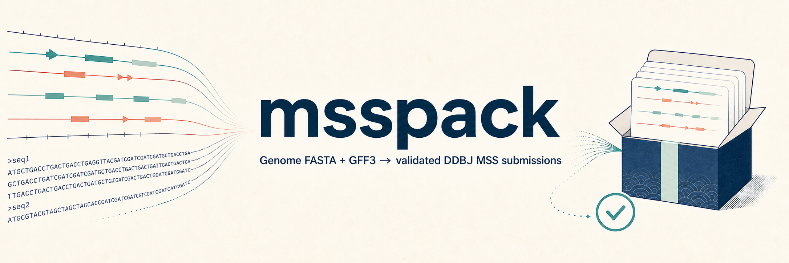
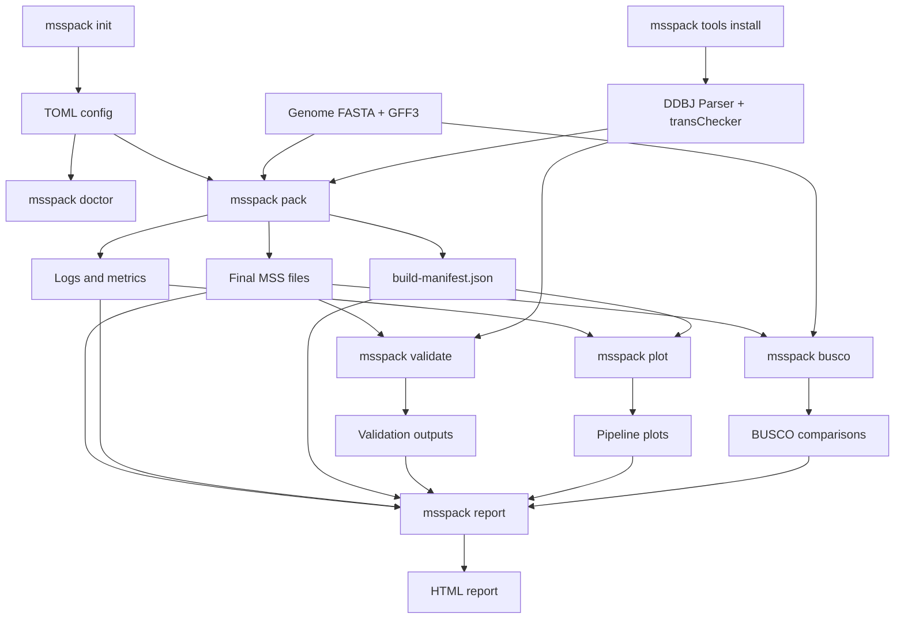
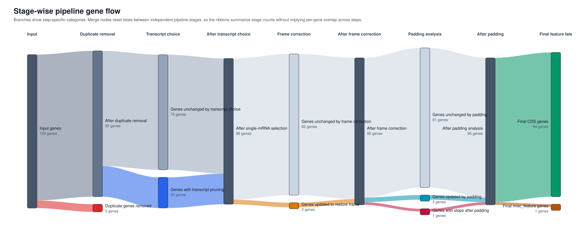
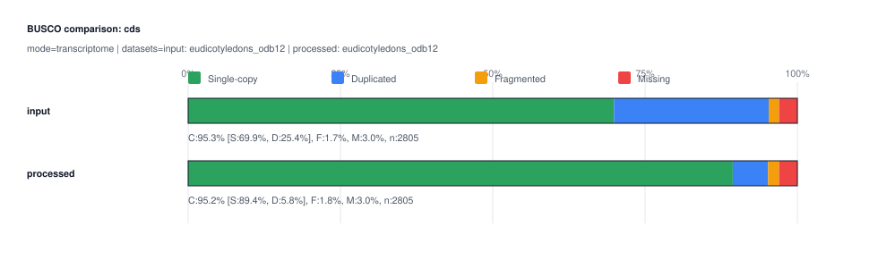

# msspack


`msspack` builds DDBJ MSS submission files from genome FASTA and GFF3 inputs. It renders MSS headers from a TOML config, runs the packaging pipeline, executes the official DDBJ validation tools, and can generate BUSCO comparisons, pipeline plots, and an HTML run report.

For the official submission workflow and file requirements, see the DDBJ [MSS - Mass Submission System](https://www.ddbj.nig.ac.jp/ddbj/mss-e.html) documentation.

## Features

- Build final MSS annotation and FASTA files from genome FASTA + GFF3 inputs
- Render `COMMON` header sections from a project TOML config
- Download and run DDBJ `Parser` and `transChecker`
- Reuse unchanged intermediate files on rerun
- Write build logs, metrics, and `build-manifest.json`
- Run BUSCO comparisons for GFF-derived CDS sets, with optional genome FASTA comparison
- Render pipeline Sankey, event-count, and changed-gene overlap plots
- Render an HTML report that links outputs, validation, BUSCO results, plots, and metrics

## Installation

Install `msspack` directly from GitHub:

```bash
pip install git+https://github.com/kfuku52/msspack.git
```

Using an isolated environment is recommended but not required.

Python 3.10 is supported through its upstream security-support lifetime. A future
minor release may require Python 3.11 or newer after Python 3.10 reaches end of life.

If you use conda or mamba, you can install the external runtime tools at the same time:

```bash
conda create -n msspack -c conda-forge -c bioconda "python>=3.10" pip openjdk busco
conda activate msspack
pip install git+https://github.com/kfuku52/msspack.git
```

`openjdk` provides the `java` command required by the DDBJ validation tools. `busco` is only needed when you run `msspack busco`; omit it if you do not need BUSCO comparison plots.

The Python packaging pipeline is platform-independent, but automated installation and
execution of the DDBJ `Parser` and `transChecker` currently supports Linux and macOS.
On Windows, use WSL or install and run the DDBJ Windows tools separately.

## Quick Start

Create a starter config:

```bash
msspack init my_submission.toml
```

`msspack init` refuses to replace an existing file. Pass `--force` only when you
intentionally want to overwrite it.

Edit the generated TOML file, then inspect your environment:

```bash
msspack doctor --config my_submission.toml
```

Install the latest DDBJ validation-tool versions reviewed by this `msspack` release
into the local cache:

```bash
msspack tools install
```

The DDBJ tools are downloaded from DDBJ and are not distributed under the `msspack`
MIT license. Review the [DDBJ validation-tool agreement](https://www.ddbj.nig.ac.jp/ddbj/mss-tool-e.html)
before installing or using them. `msspack pack` does not download these tools implicitly;
when validation is enabled, install them explicitly first.

Run the packaging pipeline:

```bash
msspack pack --config my_submission.toml
```

Generate optional downstream outputs:

```bash
msspack busco --config my_submission.toml
msspack plot --config my_submission.toml
msspack report --config my_submission.toml
```

The species-specific configs in [`examples/`](examples/) are sanitized templates for schema and workflow reference. Replace placeholder input paths and submitter details before using them for a real submission.

## Command Workflow



| Command | Main inputs | Main outputs |
| --- | --- | --- |
| `msspack init my_submission.toml` | Bundled template | Starter TOML config |
| `msspack doctor --config my_submission.toml` | Config and local environment | Dependency report |
| `msspack tools install` | DDBJ download page | Cached `Parser` and `transChecker` |
| `msspack pack --config my_submission.toml` | Config, genome FASTA, GFF3, validation tools | `final/*.ann.txt`, `final/*.fasta`, logs, metrics, manifest |
| `msspack validate --config my_submission.toml --ann final/*.ann.txt --fasta final/*.fasta` | Existing MSS files and validation tools | Parser/transChecker logs |
| `msspack busco --config my_submission.toml` | Existing `pack` outputs and CDS FASTA sets | BUSCO summaries and comparison plots |
| `msspack plot --config my_submission.toml` | Existing `pack` logs, metrics, and manifest | Pipeline plots under `plots/` |
| `msspack report --config my_submission.toml` | Outputs, logs, metrics, validation, BUSCO, and plots | `report/index.html` |

## Example Outputs

`msspack plot` renders a stage-wise Sankey diagram that summarizes how gene models move through the packaging pipeline.



`msspack busco` can render compact BUSCO comparison plots for GFF-derived CDS FASTA sets.



## Configuration

See [`examples/msspack.example.toml`](examples/msspack.example.toml) for the current schema. `msspack init` writes the same template bundled with the package.

The optional `[busco]` section controls `msspack busco`. By default, BUSCO runs on CDS FASTA files extracted from the input GFF and the final processed GFF. Set `busco.run_genome = true` or pass `--genome` to include genome FASTA comparisons.

Older configs may still contain `tools.gff3sort`; that setting is ignored because `msspack` now sorts GFF internally.

## Development

Local contributor workflow is documented in [`CONTRIBUTING.md`](CONTRIBUTING.md), and release steps are summarized in [`RELEASE.md`](RELEASE.md).

For local development:

```bash
git clone https://github.com/kfuku52/msspack.git
cd msspack
python3 -m venv .venv
source .venv/bin/activate
pip install -e ".[dev]"
```

If the repository already has an environment created for an older Python or `msspack`
release, remove and recreate that environment before installing the current development
dependencies.

Run checks locally with:

```bash
PYTHONPATH=src python -m unittest discover -s tests -v
ruff check .
mypy src
pip-audit .
```

To clean repo-local build, cache, and BUSCO artifact files before a fresh run:

```bash
python scripts/clean_artifacts.py
```

Use the benchmark harness in [`scripts/benchmark_pack.py`](scripts/benchmark_pack.py) to compare fresh and cached runs:

```bash
python scripts/benchmark_pack.py --config /path/to/config.toml --repeats 3 --no-validate
python scripts/benchmark_pack.py --config /path/to/config.toml --repeats 3 --clean-first --clean-between-runs
```

## Attribution

The MSS conversion layer in `msspack` derives from ideas and code paths originally adapted from the MIT-licensed [`GFF2MSS`](https://github.com/maedat/GFF2MSS) project by Taro Maeda. The current converter is implemented as native `msspack` modules under `src/msspack/mss_converter/`.

License and attribution details for derived or adapted code are documented in [`THIRD_PARTY_NOTICES.md`](THIRD_PARTY_NOTICES.md).

## License

`msspack` is distributed under the MIT License. See [`LICENSE`](LICENSE).
