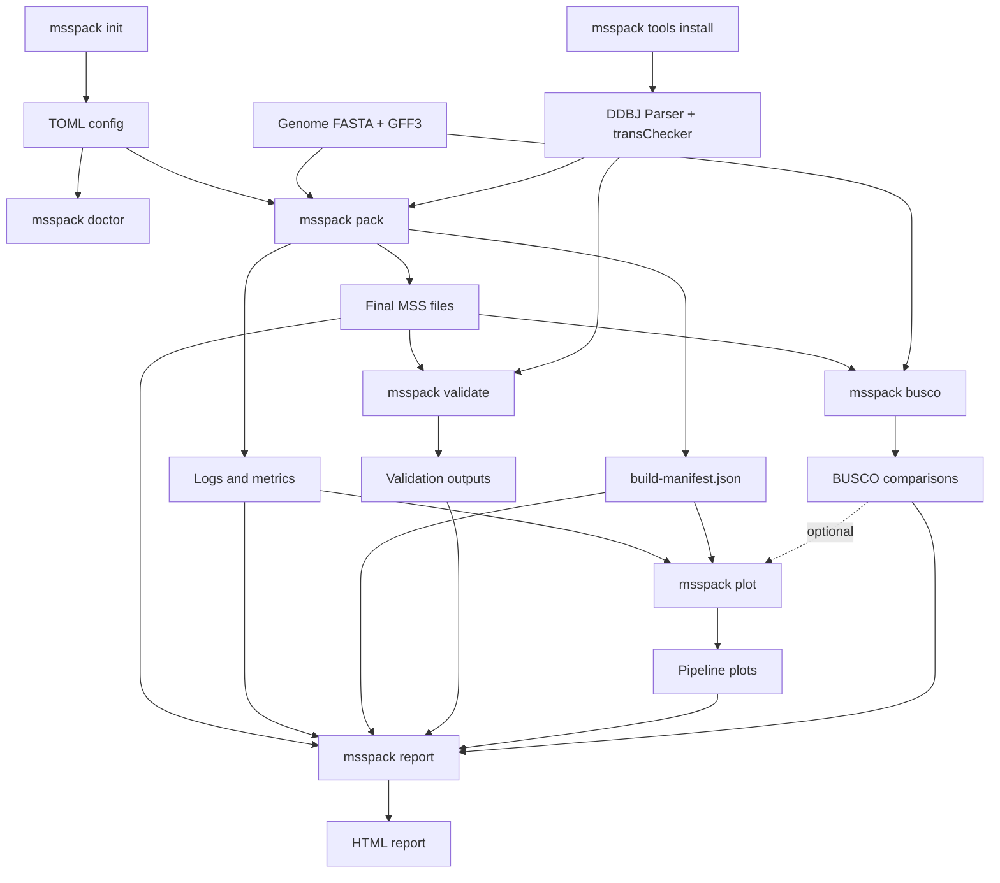

# msspack


`msspack` converts genome FASTA and GFF3 files into a DDBJ MSS submission package.
From a single TOML config, it cleans and transforms gene models, renders MSS headers
and annotation records, runs the official DDBJ validation tools, and can generate
BUSCO comparisons, pipeline plots, and an HTML run report.

For the official submission workflow and file requirements, see the DDBJ [MSS - Mass Submission System](https://www.ddbj.nig.ac.jp/ddbj/mss-e.html) documentation.

## Features

- Build final MSS annotation and FASTA files from genome FASTA + GFF3 inputs
- Render `COMMON` header sections from a project TOML config
- Download and run DDBJ `Parser` and `transChecker`
- Reuse unchanged intermediate files on rerun
- Write build logs, metrics, and `build-manifest.json`
- Optionally assign conservative protein products with Swiss-Prot, UniRef90, Pfam, and CDD
- Run BUSCO comparisons for GFF-derived CDS sets, with optional genome FASTA comparison
- Render stage-wise gene-flow, event-count, and changed-gene overlap plots
- Render an HTML report that links outputs, validation, BUSCO results, plots, and metrics

## Installation

Install `msspack` directly from GitHub:

```bash
pip install git+https://github.com/kfuku52/msspack.git
```

Using an isolated environment is recommended but not required.

Python 3.11 or newer is required. CI tests Python 3.11 through 3.14.

If you use conda or mamba, you can install the external runtime tools at the same time:

```bash
conda create -n msspack -c conda-forge -c bioconda "python>=3.11" pip openjdk busco diamond hmmer
conda activate msspack
pip install git+https://github.com/kfuku52/msspack.git
```

`openjdk` provides the `java` command required by the DDBJ validation tools. `busco`
is only needed when you run `msspack busco`. DIAMOND and HMMER are only needed when
functional annotation is enabled; omit optional tools for features you do not use.

The Python packaging pipeline is platform-independent, but automated installation and
execution of the DDBJ `Parser` and `transChecker` currently supports Linux and macOS.
On Windows, use WSL or install and run the DDBJ Windows tools separately.

## Quick Start

Create a starter config:

```bash
msspack init my_submission.toml
```

`msspack init` refuses to replace an existing file. Pass `--force` only when you
intentionally want to overwrite it.

Edit the generated TOML file, then inspect your environment:

```bash
msspack doctor --config my_submission.toml
```

Install the latest DDBJ validation-tool versions reviewed by this `msspack` release
into the local cache:

```bash
msspack tools install
```

The DDBJ tools are downloaded from DDBJ and are not distributed under the `msspack`
MIT license. Review the [DDBJ validation-tool agreement](https://www.ddbj.nig.ac.jp/ddbj/mss-tool-e.html)
before installing or using them. `msspack pack` does not download these tools implicitly;
when validation is enabled, install them explicitly first.

Run the packaging pipeline:

```bash
msspack pack --config my_submission.toml
```

Generate optional downstream outputs:

```bash
msspack busco --config my_submission.toml
msspack plot --config my_submission.toml
msspack report --config my_submission.toml
```

The species-specific configs in [`examples/`](examples/) are sanitized templates that
illustrate the schema and workflow. Replace all placeholder input paths and submitter
details before using one for a real submission.

## Command Workflow



| Command | Main inputs | Main outputs |
| --- | --- | --- |
| `msspack init my_submission.toml` | Bundled template | Starter TOML config |
| `msspack doctor --config my_submission.toml` | Config and local environment | Dependency report |
| `msspack tools install` | DDBJ download page | Cached `Parser` and `transChecker` |
| `msspack pack --config my_submission.toml` | Config, genome FASTA, GFF3, validation tools | `final/*.ann.txt`, `final/*.fasta`, logs, metrics, manifest |
| `msspack validate --config my_submission.toml --ann final/*.ann.txt --fasta final/*.fasta` | Existing MSS files and validation tools | Parser/transChecker logs |
| `msspack busco --config my_submission.toml` | Existing `pack` genome and GFF artifacts | BUSCO summaries and comparison plots |
| `msspack plot --config my_submission.toml` | Existing `pack` logs and metrics; optional CDS BUSCO comparison | Pipeline plots under `plots/` |
| `msspack report --config my_submission.toml` | Outputs, logs, metrics, validation, BUSCO, and plots | `report/index.html` |

## Example Outputs

`msspack plot` turns the pipeline logs and changed-gene ID sets into three complementary
figures:

- a stage-wise Sankey diagram of gene-model flow;
- a horizontal chart of event counts, with genes and transcripts labeled separately; and
- an UpSet-style view of exclusive overlaps among changed-gene sets.

When `busco/cds/comparison.json` is available, the Sankey diagram also shows BUSCO
compositions for CDS models derived from the input GFF and the GFF after CDS boundary
adjustment. When name-consistency results are also available, the two BUSCO pies and the
name-consistency pie share one summary row below the Sankey. Zero-count branches are
omitted from the Sankey diagram to avoid implying nonzero flow; their values remain
explicit in the event-count plot and TSV outputs.
When functional annotation evidence is present, the Sankey adds an annotation stage
that separates Swiss-Prot, UniRef90, Pfam, CDD, preserved products, and rows
that remain unannotated. These outcomes are ordered by assignment priority: Swiss-Prot,
an optional close-reference database, UniRef90, Pfam, CDD, preserved products, and
unannotated rows.


`msspack busco` also writes a standalone comparison plot for the two GFF-derived CDS
FASTA sets.


## Configuration

See [`examples/msspack.example.toml`](examples/msspack.example.toml) for the current schema. `msspack init` writes the same template bundled with the package.

The optional `[busco]` section controls `msspack busco`. By default, BUSCO evaluates
CDS FASTA sets extracted from the input GFF and the processed GFF after CDS boundary
adjustment. Set `busco.run_genome = true` or pass `--genome` to add a genome FASTA
comparison.

### Functional protein annotation

Set `functional_annotation.enabled = true` to annotate products before `ann.txt` is
rendered. The implementation searches reviewed Swiss-Prot first and then UniRef90 with
DIAMOND, ranks descriptions with an AHRD-inspired weighted lexical consensus, and uses
informative Pfam or CDD domains as conservative fallbacks. Existing non-hypothetical
products are preserved unless `overwrite_existing = true`.
UniRef90, Pfam, and CDD scan only proteins without an accepted earlier similarity
assignment. Pfam and CDD receive the same residual query set so their speed and yield are
directly comparable. Pfam partitions queries into parallel `hmmscan` shards; CDD runs
multithreaded `rpsblast` followed by representative-hit processing with `rpsbproc`.

On the first enabled run, selected databases are downloaded into `tools.cache_dir`; later
unchanged runs reuse their indexes and pipeline results. Release-provided checksums and
sizes are verified when published, and local SHA-256/provenance JSON is recorded. Set
`swissprot_fasta`, `uniref90_fasta`, `pfam_hmm`, `cdd_database`, or `cdd_data_dir` for an
offline workflow. Full UniRef90 is very large; `uniref90_taxon_id` downloads a taxonomic
subset from the UniProt REST API and retains the compressed FASTA while building DIAMOND.
A close-species protein FASTA can also be supplied through `reference_proteins`.

The final directory contains `functional-annotation.tsv`, with the original and assigned
product, database/accession, quality measurements, decision reason, and confidence for
every transcript. `functional-domain-search-comparison.tsv` records the identical Pfam/CDD
query count, queries with hits, total hits, informative assignments, duration, and rate.
DIAMOND rows also include the AHRD-style three-character quality code
for similarity significance, alignment overlap, and description-token support. DIAMOND
assignments must pass the configured identity, query coverage, subject coverage,
bit-score, E-value, near-top-hit, and token-consensus thresholds. Pfam uses model-specific
gathering thresholds (`hmmscan --cut_ga`) plus domain coverage and i-E-value filters. CDD
uses representative RPS-BLAST hits and accepts informative Specific or Superfamily models.
Uninformative descriptions, motifs, coiled coils, low-complexity regions, and
weak/conflicting evidence remain `hypothetical protein`.

The default is deliberately opt-in because the initial databases require substantial
downloads (especially Pfam) and product names should be reviewed before submission. Run
`msspack doctor --config my_submission.toml` after enabling the option to check DIAMOND,
HMMER, RPS-BLAST, and rpsbproc. Each optional fallback can be disabled independently.

Set `functional_annotation.consistency.enabled = true` to run one additional DIAMOND
all-vs-all search and audit whether directly aligned proteins receive compatible names.
The same search is evaluated at near-identical (90% identity and 90% mutual coverage),
close-family (70% and 80%), and broad-homology (40% and 60%) thresholds by default.
Connected components define candidate families, but name comparisons use only direct
alignment edges to avoid transitive chaining artifacts. The audit distinguishes exact,
safe canonical-equivalent, compatible-granularity, and conflicting name pairs.

With the default `auto_resolve_conflicts = true`, conflicts do not require manual review.
For a direct near-identical conflict, a product is propagated only when the better-priority
annotation source supplies one unambiguous name; otherwise independently supported
paralog- or subfamily-specific names are retained. Close-family-only differences are also
retained because forcing one specific name across 70/80 homologs can erase real functional
divergence. Set `auto_resolve_conflicts = false` to restore audit-only review statuses. The optional
`harmonize_safe_equivalents = true` setting only standardizes approved aliases and safe
formatting variants within near-identical families; substrate specificity, paralog
identifiers, and localization differences are not propagated between equal-priority sources.
Gene-, family-, pair-, conflict-diagnostic-, threshold-summary-, and source-pair TSV files are written
to `final/`. `msspack plot` adds a threshold-sensitivity stacked bar, an evidence-source
review-rate heatmap, and a gene-level name-consistency pie below the pipeline Sankey. Each
stacked-bar row prints its identity and mutual-coverage threshold. The name-consistency pie
shares one summary row with both BUSCO pies and uses the close-family threshold (70%
identity and 80% mutual coverage) in this order: Consistent, Auto-resolved family variation,
No annotated close-family peer, and Unannotated. “Auto-resolved family variation” means
that conflicting specific modifiers or family-name tokens were handled by the automatic
evidence policy above; no manual action is requested. “No annotated
close-family peer” means no annotated 70/80 partner was found within the analyzed proteome;
it does not mean that the gene lacks broad-homology or cross-species orthology relationships.
Figure text is consistently 8 pt; compact consistency figures are 3.6 inches wide and
multi-stage pipeline figures are 7.2 inches wide. These plots are also embedded by
`msspack report`.

In Sankey BUSCO panels, `BUSCO genes n` is the size of the selected lineage dataset, while
`CDS input n` is the number of sequences actually supplied to that BUSCO run.

Older configs may still contain `tools.gff3sort`; that setting is ignored because `msspack` now sorts GFF internally.

## Development

Local contributor workflow is documented in [`CONTRIBUTING.md`](CONTRIBUTING.md), and release steps are summarized in [`RELEASE.md`](RELEASE.md).

For local development:

```bash
git clone https://github.com/kfuku52/msspack.git
cd msspack
python3.11 -m venv .venv
source .venv/bin/activate
pip install -e ".[dev]"
```

If the repository already has an environment created for an older Python or `msspack`
release, remove and recreate that environment before installing the current development
dependencies.

Run checks locally with:

```bash
PYTHONPATH=src python -m unittest discover -s tests -v
ruff check .
mypy src
pip-audit .
```

To clean repo-local build, cache, and BUSCO artifact files before a fresh run:

```bash
python scripts/clean_artifacts.py
```

Use the benchmark harness in [`scripts/benchmark_pack.py`](scripts/benchmark_pack.py) to compare fresh and cached runs:

```bash
python scripts/benchmark_pack.py --config /path/to/config.toml --repeats 3 --no-validate
python scripts/benchmark_pack.py --config /path/to/config.toml --repeats 3 --clean-first --clean-between-runs
```

## Attribution

The MSS conversion layer in `msspack` derives from ideas and code paths originally adapted from the MIT-licensed [`GFF2MSS`](https://github.com/maedat/GFF2MSS) project by Taro Maeda. The current converter is implemented as native `msspack` modules under `src/msspack/mss_converter/`.

License and attribution details for derived or adapted code are documented in [`THIRD_PARTY_NOTICES.md`](THIRD_PARTY_NOTICES.md).

## License

`msspack` is distributed under the MIT License. See [`LICENSE`](LICENSE).
